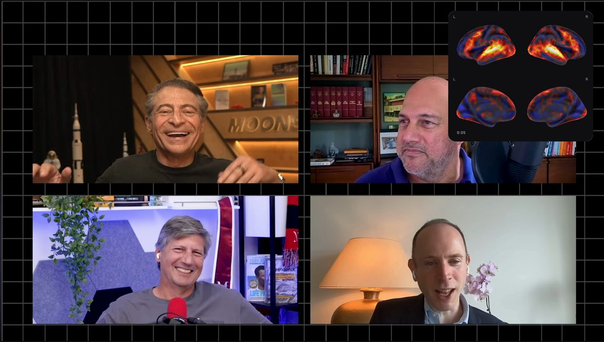
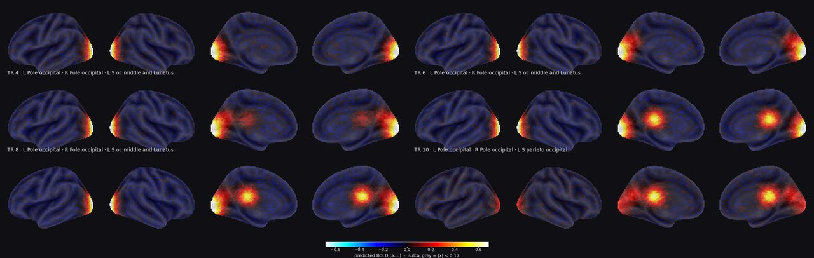
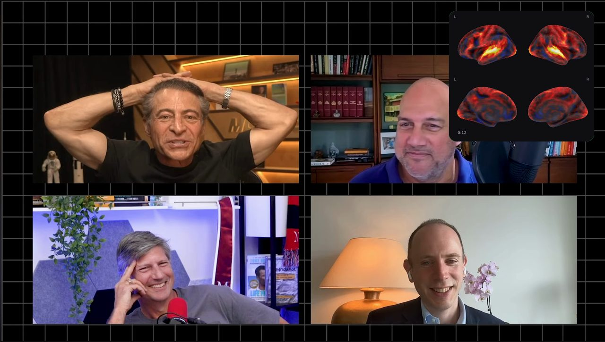
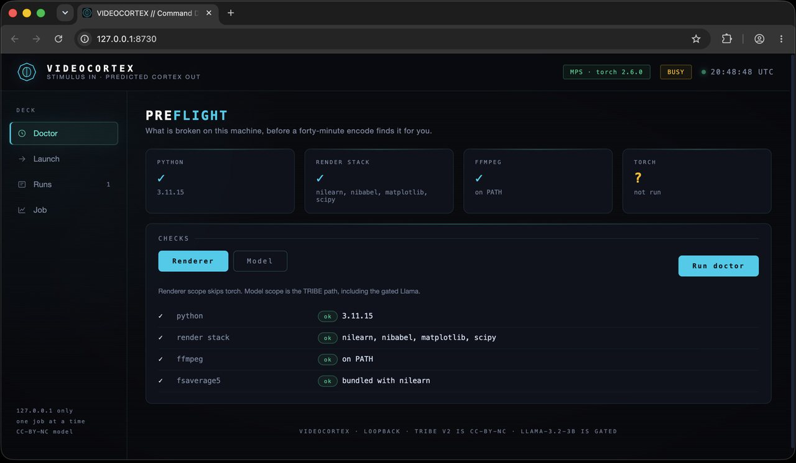
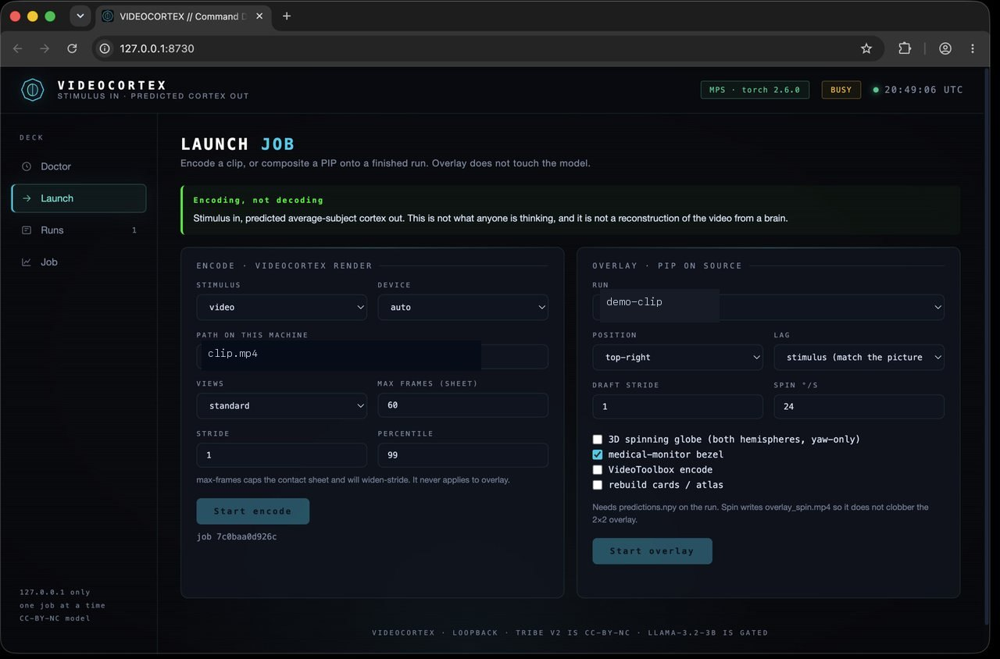
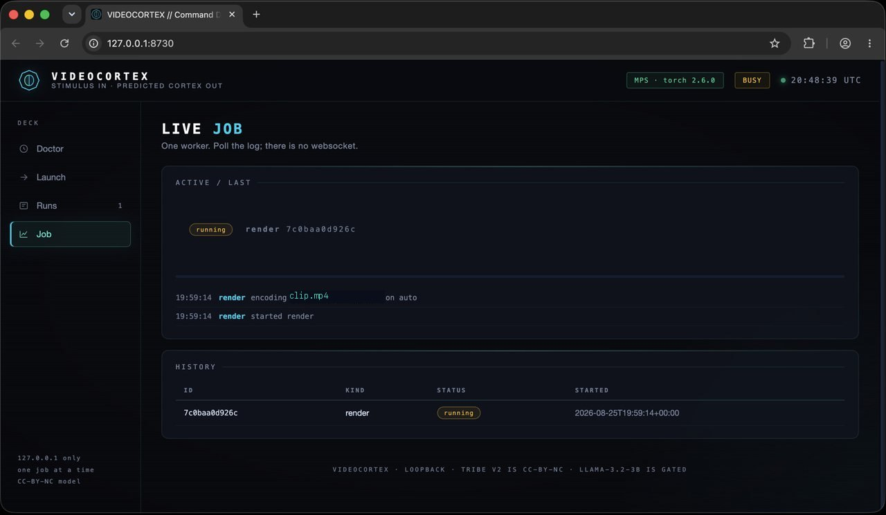
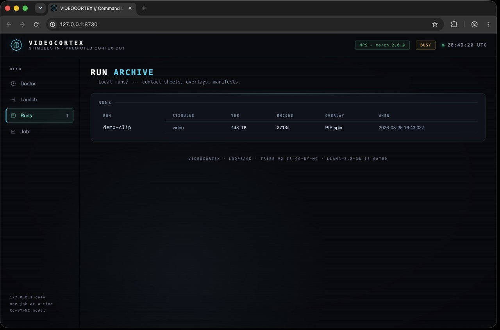
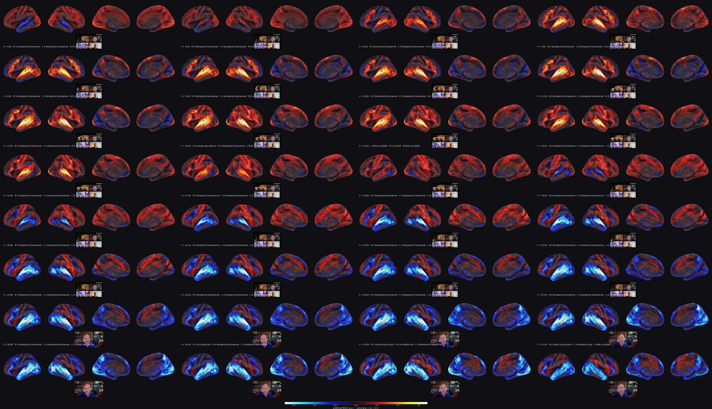

# videocortex

Drop a clip. See what it would do to an average brain.

Not a decoder, not a mind-reader, not *your* cortex. This is the encoding
direction: stimulus in, predicted fMRI out, for [TRIBE v2](https://github.com/facebookresearch/tribev2)'s
**average subject**. I wanted a simple research instrument — *which cortical
regions does this video drive?* — without a scanner, and without the model
dying on a Mac.

Upstream owns the model. This repo is the local instrument around it: Metal
instead of a silent CPU fallback, a preflight that fails in five seconds
instead of twenty gigabytes in, and plates / PIP overlays you can actually
put in a slide.



*A clip, predicted cortical response as a PIP. Shared colour limits across
the run — a quiet second stays quieter than a loud one. Read it as "this
drives these regions", never as "this is what someone is thinking".*

```
./setup_and_run.sh                 # venv + tests + synthetic sample (no model)
./setup_and_run.sh --deck          # then the loopback command deck
videocortex render --video clip.mp4
videocortex serve                  # http://127.0.0.1:8730
```



*Synthetic — a seeded, scripted occipital → temporal sequence from
`examples/make_sample.py`, used to exercise the renderer without a 20 GB
download. Run `make sample` to reproduce it. Real output looks the same; the
blobs are just less tidy.*

---

## What this is not

It does not decode brains. If you came here from
[MinD-Vis](https://mind-vis.github.io) or MinD-Video, those run the other
direction: fMRI in, picture out. This is the **encoding** direction — stimulus
in, predicted brain response out.

It also does not read *your* brain. TRIBE v2 predicts an **average subject**, at
fMRI's temporal resolution (TR ≈ 1.49 s), haemodynamically lagged and smoothed.
Upstream shifts its predictions 5 seconds into the past to compensate for that
lag, so frame *i* is the response to what happened around *i* − 5 s. Read the
output as *"this clip drives these cortical regions"*, never as *"this is what
someone is thinking"*.

---

## Install

Python 3.11+ required — upstream pins it, and 3.10 will not resolve.

```bash
git clone <this repo> && cd videocortex
./setup_and_run.sh                 # renderer only — venv, tests, synthetic sample
./setup_and_run.sh --predict       # + tribev2 + torch, for actually running the model
./setup_and_run.sh --help
```

Or by hand:

```bash
uv venv --python 3.11 && source .venv/bin/activate
pip install -e .              # renderer only — no torch
pip install -e '.[predict]'   # + tribev2 + torch
videocortex doctor
```

`videocortex doctor` (the bootstrap runs it) checks python, torch and which
accelerator it can see, ffmpeg, `uvx`, fsaverage5, free disk, and whether
HuggingFace will actually hand you each of the five model repos. Fix what it
flags before starting a run.

---

## The macOS notes

Four things in upstream assume an NVIDIA cluster. All four are handled here,
but they're worth knowing about because they're invisible until they bite.

**1. `device="auto"` never picks Metal.** Upstream resolves it as
`"cuda" if torch.cuda.is_available() else "cpu"`. On a Mac that silently means
CPU. `videocortex` resolves CUDA → MPS → CPU and sets
`PYTORCH_ENABLE_MPS_FALLBACK=1` so ops that Metal lacks drop to CPU per-op
rather than dragging the whole graph down.

**2. The published checkpoint hard-codes `device: cuda` — four times.** Not in
the model, in the *config*: each of the four frozen feature extractors carries
its own device field.

| modality | repo | config key |
|---|---|---|
| text | `meta-llama/Llama-3.2-3B` **(gated)** | `data.text_feature.device` |
| image | `facebook/dinov2-large` | `data.image_feature.image.device` |
| audio | `facebook/w2v-bert-2.0` | `data.audio_feature.device` |
| video | `facebook/vjepa2-vitg-fpc64-256` | `data.video_feature.image.device` |

Miss one and it dies partway in. `videocortex` rewrites all four, plus
`data.batch_size` (8 → 1) and `data.num_workers` (20 → 0), which were tuned for
a Slurm node with a lot more RAM than a laptop.

**3. Word timings come from `uvx whisperx --compute_type float16`**, with the
device chosen by `torch.cuda.is_available()` but the compute type hard-coded.
faster-whisper refuses float16 on CPU, so on any non-CUDA machine that
combination raises. Bare `uvx` also follows the newest Python on PATH — conda
3.14 plus a torchaudio that dropped `list_audio_backends`, which pyannote still
calls. `videocortex.patches.whisperx_cpu_compat` intercepts the subprocess:
`--python 3.11`, `torch==2.6.0` / `torchaudio==2.6.0` on CPU, `float16` →
`int8`, and `TORCH_FORCE_NO_WEIGHTS_ONLY_LOAD=1` so pyannote's VAD pickle
loads under torch 2.6. Transcript parsing stays upstream's.

**4. Llama 3.2 grouped-query attention aborts Metal.** 24 query heads vs 8
KV heads, fused SDPA, `mps.matmul` of mismatched ranks → `LLVM ERROR` and a
hard process abort, no Python traceback. `videocortex.patches.llama_mps_eager`
loads the text extractor with `attn_implementation="eager"` and float32, which
is the combination that actually returns on MPS.

**Expect it to be slow.** The 0.71 GB checkpoint is only the fusion transformer
and surface head; the real compute is V-JEPA2 ViT-g plus a 3B language model
over every chunk. Budget minutes per clip-minute on Metal, and start with
something under 30 seconds.

---

## Usage

```bash
videocortex doctor                       # preflight (model path)
videocortex doctor --renderer            # draw path only — no torch expected
videocortex fetch                        # pull all five repos up front

videocortex render --video clip.mp4
videocortex render --audio talk.wav --views full --max-frames 24
videocortex render --text  essay.txt --device cpu

videocortex draw runs/clip/predictions.npy --views lateral --light

videocortex overlay --run runs/clip
videocortex overlay --run runs/clip --spin
# → runs/clip/overlay.mp4  (PIP animation, every TR, audio re-encoded)

videocortex serve                    # loopback command deck, http://127.0.0.1:8730
```



*Overlay — 2×2 PIP at 0:12. Every TR, locked to stimulus time, not a
contact-sheet sample. Shared colour limits: a quieter second stays quieter.*

The deck is a stdlib HTTP page (no FastAPI, no extra web deps). It binds
loopback, pins the `Host` header, and refuses non-loopback peers on `/api/`
and `/media/`. Doctor, launch encode/overlay, browse runs, watch the one
job. Overlay from the deck writes `overlay_spin.mp4` when spin is on, so it
does not clobber the 2×2 PIP.



*Doctor — renderer preflight (python, nilearn, ffmpeg, fsaverage5). Torch is a
Model-scope check; the header already knows MPS is up.*



*Launch — encode a clip, or composite a PIP onto a finished run. Overlay does
not touch the model. The green strip is the encoding/decoding reminder.*



*Job — one worker, polled. A render is tens of minutes of Metal; the log is
coarse until frames start landing.*



*Runs — local `runs/` archive. Contact sheets, overlays, and manifests;
click a row for the video.*

`draw` re-renders a saved prediction without touching the model — inference
costs minutes, changing your mind about the colormap shouldn't. `overlay`
is the same idea for film: dense 2×2 cards from `predictions.npy`, composited
top-right onto the source video. It does **not** reuse `frames/` (those may
be a 12-tile sample of a 433-TR run).

### Options worth knowing

| flag | what it does |
|---|---|
| `--views` | `standard` (L/R lateral + medial), `lateral`, `medial`, `left`, `right`, `occipital`, `full` |
| `--stride N` | render every Nth TR |
| `--max-frames N` | hard cap; if stride overshoots it, the stride *widens* rather than truncating, so the whole clip stays sampled |
| `--percentile` | robust colour limit (default 99th of \|x\|) |
| `--threshold-frac` | hide vertices below this fraction of vmax (default 0.25) |
| `--ramp-frac` | fade colour in across that band below threshold instead of a hard pop (default 0.5; `0` = hard cut) |
| `--no-filmstrip` | drop the stimulus frame above each contact-sheet tile |
| `--no-regions` | drop the Destrieux region names from plate titles |
| `--device` | `auto` \| `cuda` \| `mps` \| `cpu`. Explicit values raise if unavailable rather than silently falling back |
| `--light` | light background instead of dark |

Overlay (`videocortex overlay --run …`):

| flag | what it does |
|---|---|
| `--size` | PIP width as a fraction of the frame (default 0.24, landscape) |
| `--position` | `top-right` (default) or `top-left` |
| `--lag-mode` | `stimulus` matches the picture (default). `scanner` delays the PIP 5 s |
| `--stride N` | draft: every Nth TR (default 1 — every TR, never widen-stride) |
| `--fast` | VideoToolbox encode |
| `--force` | rebuild `pip/` cards |
| `--spin` | 3D inflated globe in the PIP (both hemispheres, yaw-only) |
| `--dps` | spin rate in degrees per second (12–48, default 24) |
| `--fps` | spin frame rate (default 24) |
| `--az-step` | atlas yaw step in degrees (default 2; smaller is smoother) |
| `--ramp-frac` | soft-threshold band (default 0.5; `0` = hard edge) |
| `--no-monitor` | skip the black plate and green medical-monitor bezel |
| `--no-ribbon` | skip the energy curve + playhead under the PIP |
| `--no-regions` | skip Destrieux region names (auto-skipped if the atlas can't fetch) |

The spin PIP interpolates palettes **between TRs** and blends between atlas
poses, so the globe flows instead of cutting once per second. The energy
ribbon shows mean |signal| across the whole clip on one shared (sqrt-
compressed) scale with a playhead — when the colour scale goes dark, the
ribbon tells the viewer the brain went quiet rather than the render broke.
Output is tagged bt709 through a `setparams` filter; without it players
guess bt601 and eat the overlay's reds and greens.

### Output

```
runs/clip/
├── frames/frame_00000.png     one plate per rendered TR (contact-sheet sample)
├── contact_sheet.png          all frames + stimulus filmstrip, one colourbar
├── stim/stim_000.jpg          the filmstrip grabs (filmstrip runs only)
├── pip/frame_XXXXX.png        every TR, compact 2×2 card (overlay cache)
├── pip_spin/                  --spin atlas + unique (TR, pose) frames
├── overlay.mp4                source video + PIP
├── predictions.npy            (n_timesteps × 20484) float32
├── timestamps.npy
└── manifest.json              config, versions, timings — enough to reproduce
```



*Contact sheet from a real encode. Stimulus filmstrip above each tile,
Destrieux names on the labels, one colourbar for the whole run — not a
per-frame stretch.*

---

## One design decision worth defending

**Colour limits are computed once over the whole run, never per frame.**

Per-frame normalisation is the default in a lot of quick visualisation code and
it is quietly dishonest: it makes a resting moment render exactly as vividly as
a startling one, because each frame gets restretched to fill the colormap. Every
frame here shares one scale, derived from a robust percentile across the entire
prediction so a single berserk vertex can't flatten everything else. There's a
test that fails if per-frame rescaling ever creeps back in.

---

## Layout

```
src/videocortex/
├── cli.py         six verbs: doctor, fetch, render, draw, overlay, serve
├── config.py      RunConfig / RenderConfig / OverlayConfig, view presets
├── device.py      CUDA → MPS → CPU, testable without torch
├── doctor.py      preflight checks
├── model.py       loads TRIBE v2 with the config overrides that make it portable
├── overlay.py     PIP animation: dense cards + ffmpeg composite
├── spin.py        3D globe PIP: pose atlas + per-TR recolor
├── patches.py     the whisperx CPU fix, isolated and documented
├── pipeline.py    predict → render
├── render.py      nilearn-backed plates, contact sheets, PIP cards
├── regions.py     Destrieux region names for the top activations per TR
├── stimulus.py    filmstrip grabs for the contact sheet
├── weights.py     pre-download the checkpoint and the four encoders
└── web/           loopback command deck (ThreadingHTTPServer + static SPA)
```

`render.py` deliberately depends on nilearn alone. That's why `pip install -e .`
without the `predict` extra gives you a working `draw` command, and why the
renderer is testable in CI without a GPU.

```bash
pytest              # everything
pytest -m "not slow"   # skip the ones that actually rasterise surfaces
```

---

## Licence

This wrapper is MIT — see `LICENSE`.

**The model is not.** TRIBE v2 and its weights are CC-BY-NC-4.0: research and
other non-commercial use only. `meta-llama/Llama-3.2-3B` carries its own
community licence and is gated; you must accept it on HuggingFace before
anything here will run. See `NOTICE.md`.

## Credit

TRIBE v2 — d'Ascoli, Rapin, Benchetrit, Brooks, Begany, Raugel, Banville and
King (Meta FAIR Brain & AI), *A foundation model of vision, audition, and
language for in-silico neuroscience*, 2026.
[paper](https://arxiv.org/abs/2605.04326) ·
[code](https://github.com/facebookresearch/tribev2) ·
[weights](https://huggingface.co/facebook/tribev2)
